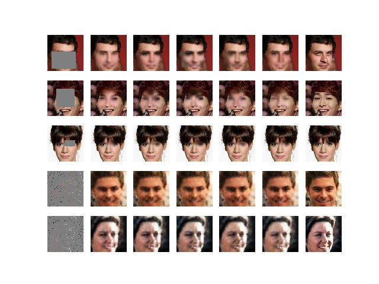

# Variational Autoencoder with Arbitrary Conditioning for Image Inpainting in TensorFlow 2.0
An implementation of the paper "Variational Autoencoders with Arbitrary Conditional" in TensorFlow 2.0. This implementation is based on the original code by the paper authors ([link](https://github.com/tigvarts/vaeac)) 
## Installation
```bash
pip install virtualenv
virtualenv -p python3 .env
source .env/bin/activate
pip install -r requirements.txt
```

## How to run
### Prepare CelebA dataset
```bash
python run.py --mode prepare
```

### Debug
```bash
python run.py --mode debug
```

### Training
```bash
python run.py --mode train
```
### Inpainting
```bash
python run.py --mode inpaint
```

## Some inpainted results on CelebA
We train the model in 40 epochs on the CelebA dataset. Below are some inpainted results generated by our trained model. The first column indicates input images with arbitrary masks to be inpainted. The last column indicates ground truth images. And the remaining columns are inpainted images.
<p align="center">  </p>

<p align="center">  </p>


**References**
1. Oleg Ivanov, Michael Figurnov, Dmitry Vetrov. Variational Autoencoder with Arbitrary Conditioning. ICLR 2019 ([arxiv](https://arxiv.org/pdf/1806.02382.pdf))
